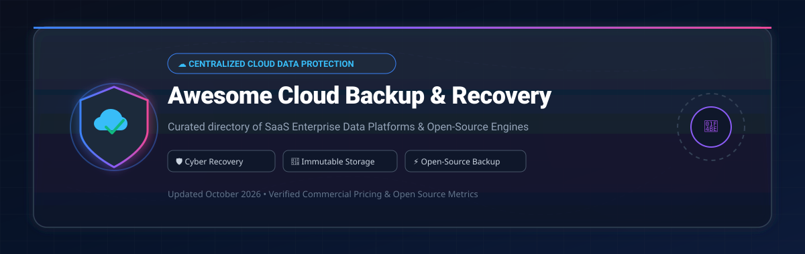

# Awesome-Centralized-Cloud-Backup-Recovery ☁️ 🛡️

  

  

---

## 🌟 Centralized Cloud Backup & Disaster Recovery Ecosystem

**Curated Directory of Commercial Enterprise Data Protection Platforms & Open-Source Backup Frameworks** 🚀

*Focused on Cloud-Native Backup, Ransomware Cyber Recovery, Immutable Storage, Deduplication, and Self-Hosted Enterprise Backup Servers.*

**Last updated: October 2026** 📅

---

### 📌 Overview & SEO Summary

Welcome to the definitive curated index of **centralized cloud backup and disaster recovery solutions**, **open-source backup engines**, and **cyber-resilient data protection frameworks**. Modern cloud and hybrid enterprise infrastructure requires robust data backup, point-in-time recovery (PITR), air-gapped immutable storage, and zero-trust security to defend against ransomware, accidental deletion, and hardware outages.

Whether evaluating enterprise SaaS vendors (such as *Rubrik*, *Veeam*, *Commvault*, *AWS Backup*, and *Cohesity*) or self-hosted open-source software (like *Restic*, *Duplicati*, *Kopia*, *BorgBackup*, and *Velero*), this guide offers verifiable pricing, free tier details, company valuations, and real-time GitHub repository statistics.

---

## 📑 Table of Contents

- [🏢 SaaS & Commercial Enterprise Platforms](#-saas--commercial-enterprise-platforms)
- [🔓 Open-Source GitHub Backup Projects](#-open-source-github-backup-projects)
- [🛠️ How to Contribute](#%EF%B8%8F-how-to-contribute)
- [⭐ Star History](#-star-history)
- [🤝 Support & Sponsorship](#-support--sponsorship)
- [⚠️ Disclaimer](#%EF%B8%8F-disclaimer)

---

## 🏢 SaaS & Commercial Enterprise Platforms

> 📊 **Market Dynamics & Estimated Sector Size**: The global enterprise cloud data backup and disaster recovery market is estimated at **~$14.5 Billion in 2024 and projected to reach ~$25.8 Billion by 2030 (9.8% CAGR)**. The sector is **moderately fragmented**, balancing legacy virtualization giants (*Veeam*, *Commvault*), cyber-recovery leaders (*Rubrik*, *Cohesity*), cloud-native SaaS protection platforms (*AWS Backup*, *Druva*, *HYCU*), and self-hosted open-source tools.

*Sorted by Company Size / Market Cap / Valuation (Descending)* 📉

| 🏢 SaaS / Commercial Platform | 🏢 Company / Owner | 💰 Valuation / Market Cap | 💲 Standard Edition Starting Price | 🎁 Free Tier / Free Trial Limits | 📝 Description & Key Capabilities |
| :--- | :--- | :--- | :--- | :--- | :--- |
| **[AWS Backup](https://aws.amazon.com/backup/)** ☁️ | Amazon Inc. | ~$2.0 Trillion (Market Cap) | $0.05 per GB-month (EBS warm backup); $0.01 per GB-month (EFS cold archive) | AWS Free Tier includes 20 GB of backup storage for EFS per month for 12 months | **AWS-native centralized backup** — Fully managed policy-based data protection across EBS, RDS, DynamoDB, EFS, S3, and Storage Gateway with cross-region immutable vault support. |
| **[Rubrik Security Cloud](https://www.rubrik.com/)** 🟣 | Rubrik Inc. | ~$6.5 Billion (Valuation / Public) | ~$200 per TB/year software subscription (~$16.67/TB-month starting tier) | 30-day Enterprise Free Trial with up to 10 TB backup capacity and full Ransomware Investigation | **Enterprise data security platform** — Zero-trust SaaS control plane with air-gapped immutable backups, automated ransomware threat hunting, and rapid cyber recovery orchestration. |
| **[Veeam Data Platform](https://www.veeam.com/)** 🟢 | Veeam Software | ~$5.0 Billion (Valuation) | ~$180 per workload license/year ($1,800/year for 10-workload VUL bundle) | Veeam Community Edition (Free forever for up to 10 VMs/workloads with full backup capabilities) | **Virtualization & cloud backup benchmark** — Industry leader for VMware vSphere, Hyper-V, AWS, Azure, and Kubernetes data protection with instant VM recovery. |
| **[Commvault Cloud](https://www.commvault.com/)** 🔵 | Commvault Systems | ~$4.2 Billion (Market Cap) | ~$1.00 per VM/month or $0.05 per GB-month for enterprise cloud backup | 30-day full-featured free trial with 1 TB cloud backup capacity included | **Enterprise cyber resilience platform** — Cleanroom Recovery isolates restoration environments to eliminate malware re-infection during disaster recovery. |
| **[Acronis Cyber Protect](https://www.acronis.com/)** 🛡️ | Acronis International | ~$3.5 Billion (Valuation) | $85 per workstation/year ($129 per server/year standard license) | 30-day fully functional free trial with 100 GB Cloud Storage included | **Integrated backup & endpoint security** — Combines AI-driven anti-ransomware protection, vulnerability assessment, and disk image backups in a unified agent. |
| **[Cohesity Data Cloud](https://www.cohesity.com/)** 🟠 | Cohesity (Merged with Veritas NetBackup) | ~$3.0 Billion (Valuation) | ~$150 per TB/year software license for backup & recovery | 30-day virtual appliance free trial with 5 TB backup capacity | **Hyperconverged secondary storage** — Scale-out SpanFS architecture consolidating backups, target storage, file shares, and threat scanning on a unified data platform. |
| **[Druva Resiliency Cloud](https://www.druva.com/)** ☁️ | Druva Inc. | ~$2.0 Billion (Valuation) | $2.50 per M365 user/month or $210 per TB/month deduplicated data | 30-day free trial with 1 TB deduplicated storage and full Microsoft 365/VM protection | **100% pure SaaS data protection** — Zero customer-managed infrastructure. Deduplication engine compresses footprint before writing to cloud storage. |
| **[HYCU for Enterprise](https://www.hycu.com/)** 🧬 | HYCU Inc. | ~$500 Million (Valuation) | $2.25 per M365 user/month ($4.00 per Atlassian user/month) | 14-day free trial with unlimited backup jobs for up to 25 users/workloads | **Hybrid & SaaS multi-cloud backup** — Writes backups directly to customer-owned storage (AWS S3, GCP Cloud Storage, Wasabi) with agentless protection. |
| **[Clumio (by Commvault)](https://www.commvault.com/clumio/)** 🎯 | Commvault / Clumio | ~$160 Million (Acquisition) | $0.025 per GiB-month for AWS S3 backups ($0.045/GiB-mo for EC2) | 14-day free trial with $500 AWS backup credit included | **AWS-native backup-as-a-service** — Provides instant granular S3 object recovery, EBS snapshot management, and automated continuous compliance logging. |
| **[Bacula Systems Enterprise](https://www.baculasystems.com/)** 🏢 | Bacula Systems SA | ~$50 Million (Valuation) | ~$3,500 per year base subscription (unlimited data volume) | Bacula Community Edition is Free Forever (AGPLv3) with unlimited endpoints | **Enterprise-grade open-core backup** — Extends Bacula core engine with global deduplication, VMware/Hyper-V integration, cloud targets, and 24/7 enterprise SLA. |

---

## 🔓 Open-Source GitHub Backup Projects

*Sorted by GitHub Star Count (Descending)* ⭐

- **[rclone](https://github.com/rclone/rclone)**  🌐  
  **The Swiss Army knife of cloud storage sync**, MIT licensed. Command-line program to manage files on 70+ cloud storage providers (S3, Google Drive, OneDrive, B2, SFTP). Features bandwidth throttling, client-side encryption, chunked streaming, and mount capabilities. Frequently serves as the underlying transfer engine for custom backup scripts.

- **[restic](https://github.com/restic/restic)**  ⚡  
  **Fast, secure, and efficient backup program**, BSD-2-Clause licensed. Single static binary with zero external dependencies. Features AES-256 client-side encryption, content-defined chunking (CDC) deduplication, and snapshot verification. Supports S3, Azure Blob, Google Cloud Storage, B2, SFTP, and local repositories.

- **[Duplicati](https://github.com/duplicati/duplicati)**  🔒  
  **Free backup client for encrypted cloud backups**, LGPL-2.1 licensed. Stores AES-256 encrypted, incremental, compressed backups across 20+ cloud storage targets. Includes a user-friendly Web UI, built-in scheduler, volume management, and integrity checks.

- **[Kopia](https://github.com/kopia/kopia)**  🛡️  
  **Fast and secure open-source backup & sync engine**, Apache-2.0 licensed. Offers end-to-end client-side encryption, deduplication, compression, policy-driven snapshot retention, and both CLI and Desktop GUI interfaces. Supports cloud storage, NAS, and local disks.

- **[BorgBackup](https://github.com/borgbackup/borg)**  🔐  
  **Deduplicating archiver with compression and authenticated encryption**, BSD-3-Clause licensed. Deduplicates data based on content-defined chunking. Supports authenticated AES-256 encryption, SSH remote backup repositories, and FUSE mountable archives.

- **[Velero](https://github.com/velero-io/velero)**  ☸️  
  **Kubernetes cluster backup and disaster recovery**, Apache-2.0 licensed. Backs up cluster state resources and persistent storage volumes across AWS, Azure, GCP, and on-premises Kubernetes clusters. Enables application migration and disaster recovery.

- **[Backrest](https://github.com/garethgeorge/backrest)**  🖥️  
  **Web UI and orchestrator for restic backup**, GPL-3.0 licensed. Provides a modern web dashboard for scheduling, managing repositories, reviewing backup history, and monitoring restic snapshots across multiple machines.

- **[Spatie Laravel-Backup](https://github.com/spatie/laravel-backup)**  📦  
  **Database and application backup tool for Laravel**, MIT licensed. Automatically creates zip archives of application files and database dumps, storing them across multiple cloud providers with automated cleanup and health notifications.

- **[Zalando Postgres Operator](https://github.com/zalando/postgres-operator)**  🐘  
  **PostgreSQL disaster recovery and high availability on Kubernetes**, MIT licensed. Manages automated continuous database backups to S3-compatible cloud storage, write-ahead logging (WAL) archiving, and point-in-time recovery (PITR).

- **[WAL-G](https://github.com/wal-g/wal-g)**  💾  
  **Archiving and restore tool for PostgreSQL, MySQL, and MariaDB**, Apache-2.0 licensed. Successor to WAL-E written in Go. Features multi-core LZ4/snappy compression, delta backups, parallel S3 uploads, and low overhead PITR recovery.

- **[Vorta](https://github.com/borgbase/vorta)**  🖥️  
  **Desktop backup client for BorgBackup on macOS and Linux**, GPL-3.0 licensed. Integrates BorgBackup into desktop notification environments with profile management, scheduled background snapshots, and one-click file restoration.

- **[Bareos](https://github.com/bareos/bareos)**  📦  
  **Cross-network open-source backup software**, AGPL-3.0 licensed. Fork of Bacula providing client-server network backups, encryption, LTO tape library support, cloud storage backends, and web UI administration.

- **[nxs-backup](https://github.com/nixys/nxs-backup)**  🛠️  
  **Automated backup rotation and delivery tool**, Apache-2.0 licensed. Supports MySQL, PostgreSQL, MongoDB, Redis, and ClickHouse database backups with S3/SFTP storage delivery, resource rate limiting, and Webhook/Prometheus alerts.

- **[Bacula Web](https://github.com/bacula-web/bacula-web)**  📊  
  **Open-source reporting and monitoring console for Bacula**, GPL-2.0 licensed. Provides a Web dashboard to monitor Bacula backup job statuses, pool capacities, volumes, and backup metrics.

---

## 🛠️ How to Contribute

Contributions are warmly welcomed! 🤝 Follow these guidelines when submitting new cloud backup solutions or open-source software:

1. 🍴 **Fork** this repository.
2. 📝 **Add or update** entries in `README.md` following the exact table/list structure and formatting rules.
3. 🔗 Include official vendor links, exact pricing numbers, free trial/tier specifications, and valid GitHub repository badges linked to `/stargazers`.
4. 🚀 Open a **Pull Request** detailing your additions.

---

## ⭐ Star History

---

## 🤝 Support & Sponsorship

If this curated directory has helped you evaluate backup platforms or safeguard enterprise infrastructure, please consider supporting the project:

- ⭐ **Star this repository** to improve discoverability across GitHub!
- 🔀 **Fork & share** with system administrators, DevOps engineers, and cloud architects.
- ☕ **Sponsor & Buy Me a Coffee**: Support ongoing open-source research and maintenance via the [GitHub Sponsor Dashboard](https://github.com/sponsors/ishandutta2007).

---

## ⚠️ Disclaimer

- This directory is **community-curated** for informational purposes — it does not constitute an endorsement or financial advice. ℹ️
- **Pricing & Tier Accuracy**: Cloud storage rates, egress pricing, and SaaS licensing change frequently. Always verify current vendor quotes before purchasing.
- **Storage & Egress Fees**: Solutions like HYCU and Druva write data to cloud storage targets where network egress or API operation charges may apply during large restore operations.
- **Restore Testing**: Having a backup engine is only half the battle. **Regularly execute automated disaster recovery restore drills** to verify backup integrity and Recovery Time Objectives (RTO). 🛡️

---

  <b>Made with ❤️ for IT administrators, DevOps engineers, and open-source data protection advocates.</b>

